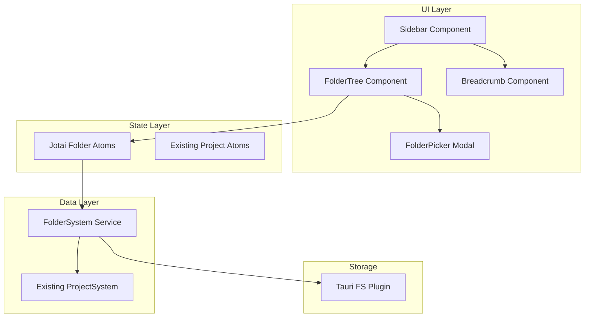

# Design Document: Folder Organization

## Overview

This feature extends Buza Studio's project management capabilities by introducing a hierarchical folder system. Users can create folders to organize their prompt projects, move projects between folders via drag-and-drop or context menus, and navigate through nested folder structures. The folder hierarchy is persisted to the filesystem using the existing `buza-projects` directory structure, where folders become subdirectories.

## Architecture

The folder organization feature integrates with the existing project system architecture:



### Key Design Decisions

1. **Filesystem-based hierarchy**: Folders map directly to filesystem directories within `buza-projects/`. This provides natural persistence and allows external tools (Git, file managers) to work with the structure.

2. **Extend existing ProjectSystem**: Rather than creating a separate system, we extend `ProjectSystem` with folder-aware methods to maintain consistency.

3. **Lazy loading**: Folder contents are loaded on-demand when expanded to maintain performance with large project libraries.

4. **Optimistic UI updates**: UI updates immediately on user actions, with filesystem operations happening asynchronously.

## Components and Interfaces

### FolderSystem Extension (src/lib/folder-system.ts)

```typescript
export interface Folder {
  id: string;           // UUID for React keys
  name: string;         // Display name (directory name)
  path: string;         // Relative path from buza-projects root
  parentPath: string | null;  // Parent folder path, null for root
  children: FolderItem[];     // Loaded children (folders and projects)
  isExpanded: boolean;        // UI state
}

export interface FolderItem {
  type: 'folder' | 'project';
  id: string;
  name: string;
  path: string;
}

export interface FolderTree {
  rootItems: FolderItem[];    // Top-level folders and projects
  folders: Map<string, Folder>;  // All loaded folders by path
}

// Extension methods for ProjectSystem
export interface FolderOperations {
  // Folder CRUD
  createFolder(parentPath: string | null, name: string): Promise<Folder>;
  renameFolder(folderPath: string, newName: string): Promise<Folder>;
  deleteFolder(folderPath: string, moveContentsToParent: boolean): Promise<void>;
  
  // Navigation
  listFolderContents(folderPath: string | null): Promise<FolderItem[]>;
  getFolderTree(): Promise<FolderTree>;
  
  // Move operations
  moveProject(projectName: string, targetFolderPath: string | null): Promise<void>;
  moveFolder(folderPath: string, targetFolderPath: string | null): Promise<void>;
  
  // Search
  searchProjects(query: string): Promise<SearchResult[]>;
  
  // Validation
  isValidMoveTarget(sourcePath: string, targetPath: string): boolean;
  generateUniqueName(parentPath: string | null, baseName: string): Promise<string>;
}

export interface SearchResult {
  project: Project;
  folderPath: string;
  matchedText: string;
}
```

### FolderTree Component (src/components/FolderTree.tsx)

```typescript
interface FolderTreeProps {
  items: FolderItem[];
  expandedFolders: Set<string>;
  selectedItemId: string | null;
  onFolderToggle: (folderId: string) => void;
  onItemSelect: (item: FolderItem) => void;
  onItemMove: (sourceId: string, targetFolderId: string | null) => void;
  onFolderCreate: (parentPath: string | null) => void;
  onFolderRename: (folderId: string, newName: string) => void;
  onFolderDelete: (folderId: string) => void;
}
```

### Breadcrumb Component (src/components/Breadcrumb.tsx)

```typescript
interface BreadcrumbProps {
  path: string[];  // Array of folder names from root to current
  onNavigate: (index: number) => void;  // Navigate to path segment
}
```

### Jotai Atoms (src/atoms/folder-atoms.ts)

```typescript
// Folder tree state
export const folderTreeAtom = atom<FolderTree>({ rootItems: [], folders: new Map() });

// Currently expanded folders
export const expandedFoldersAtom = atom<Set<string>>(new Set());

// Current folder path for navigation
export const currentFolderPathAtom = atom<string | null>(null);

// Derived atom for breadcrumb
export const breadcrumbPathAtom = atom((get) => {
  const currentPath = get(currentFolderPathAtom);
  if (!currentPath) return [];
  return currentPath.split('/');
});
```

## Data Models

### Filesystem Structure

```
~/Documents/buza-projects/
├── library.json
├── templates.json
├── Project-A/                    # Root-level project
│   ├── project.json
│   └── Main.md
├── Work/                         # Folder
│   ├── .folder                   # Marker file (empty, identifies as folder)
│   ├── Client-Prompts/           # Nested folder
│   │   ├── .folder
│   │   └── Email-Generator/      # Project inside nested folder
│   │       ├── project.json
│   │       └── Main.md
│   └── Internal-Tools/           # Project inside folder
│       ├── project.json
│       └── Main.md
└── Personal/                     # Another folder
    ├── .folder
    └── Blog-Writer/
        ├── project.json
        └── Main.md
```

### Folder Identification

Folders are distinguished from projects by:
1. Presence of a `.folder` marker file (empty file)
2. Absence of `project.json` file

This allows the system to differentiate between:
- A folder named "Work" (has `.folder`, no `project.json`)
- A project named "Work" (has `project.json`, no `.folder`)

### Project Path Updates

When a project is moved, its internal references remain unchanged. The `project.json` stores relative paths for variants, so moving the entire directory preserves integrity.

## Correctness Properties

*A property is a characteristic or behavior that should hold true across all valid executions of a system-essentially, a formal statement about what the system should do. Properties serve as the bridge between human-readable specifications and machine-verifiable correctness guarantees.*

Based on the prework analysis, the following correctness properties have been identified:

### Property 1: Folder creation uniqueness
*For any* parent folder and base name, creating a folder SHALL result in a unique folder name at that level. If a folder with the same name exists, a numeric suffix SHALL be appended.
**Validates: Requirements 1.4**

### Property 2: Folder persistence round-trip
*For any* folder tree structure, persisting to the filesystem and then reading back SHALL produce an equivalent folder tree structure.
**Validates: Requirements 1.3, 6.1, 6.3**

### Property 3: Project move preserves data integrity
*For any* project with variants, variables, and versions, moving the project to any valid folder SHALL preserve all project data unchanged.
**Validates: Requirements 2.3, 2.4**

### Property 4: Folder contents listing completeness
*For any* folder containing subfolders and projects, listing the folder contents SHALL return all subfolders and all projects within that folder.
**Validates: Requirements 3.4**

### Property 5: Folder rename persistence
*For any* folder, renaming it SHALL update the filesystem directory name and all child paths accordingly.
**Validates: Requirements 4.2**

### Property 6: Empty folder deletion
*For any* empty folder, deleting it SHALL remove the folder from the filesystem and the folder tree.
**Validates: Requirements 4.3**

### Property 7: Non-empty folder deletion preserves contents
*For any* folder containing projects, deleting the folder SHALL move all contained projects to the parent folder before removing the folder.
**Validates: Requirements 4.5**

### Property 8: Folder nesting updates hierarchy
*For any* two folders where neither is an ancestor of the other, nesting one inside the other SHALL update the folder hierarchy correctly.
**Validates: Requirements 5.1**

### Property 9: Circular nesting prevention
*For any* folder and any of its descendants, attempting to move the folder into that descendant SHALL be rejected.
**Validates: Requirements 5.4**

### Property 10: Cross-folder search with paths
*For any* search query and folder structure, search SHALL return all matching projects from all folders with their correct folder paths.
**Validates: Requirements 7.1, 7.2**

## Error Handling

| Error Scenario | Handling Strategy |
|----------------|-------------------|
| Folder name collision | Auto-generate unique name with numeric suffix |
| Circular folder move | Prevent operation, show error toast |
| Delete non-empty folder | Show confirmation dialog with content count |
| Filesystem permission error | Show error toast, revert optimistic update |
| Invalid folder path | Validate paths before operations, reject invalid |
| Project move fails mid-operation | Rollback to original location if possible |

### Error Messages

```typescript
const FOLDER_ERRORS = {
  CIRCULAR_MOVE: "Cannot move a folder into one of its subfolders",
  NAME_COLLISION: "A folder with this name already exists",
  DELETE_FAILED: "Failed to delete folder. Please check file permissions.",
  MOVE_FAILED: "Failed to move item. Please try again.",
  INVALID_PATH: "Invalid folder path specified",
};
```

## Testing Strategy

### Unit Testing

Unit tests will cover:
- Folder name uniqueness generation
- Path validation and manipulation
- Circular reference detection
- Folder/project type detection from filesystem

Testing framework: Vitest (already used in the project)

### Property-Based Testing

Property-based tests will use **fast-check** library to verify the correctness properties defined above.

Each property-based test will:
- Generate random folder structures, project data, and operations
- Execute operations against the FolderSystem
- Verify the property holds for all generated inputs
- Run a minimum of 100 iterations per property

Test annotations will follow this format:
```typescript
// **Feature: folder-organization, Property 1: Folder creation uniqueness**
// **Validates: Requirements 1.4**
```

### Integration Testing

Integration tests will verify:
- End-to-end folder creation, move, and delete workflows
- Drag-and-drop interactions
- Search functionality across nested folders
- Persistence across application restarts

### Test File Structure

```
src/
├── lib/
│   ├── folder-system.ts
│   └── folder-system.test.ts      # Unit + property tests
└── components/
    ├── FolderTree.tsx
    └── FolderTree.test.tsx        # Component tests
```
